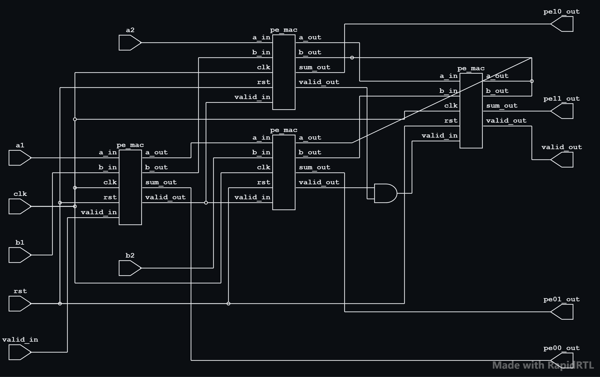
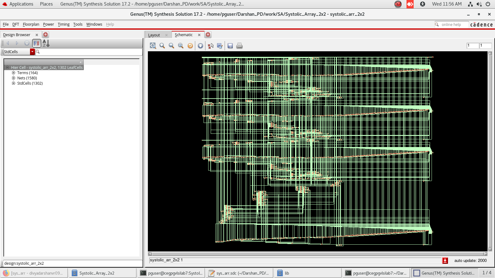

# 2×2 Systolic MAC Array ASIC Implementation
## Project Overview

- This project presents the RTL design, verification, synthesis, gate-level simulation (GLS), and static timing analysis (STA) of a 2×2 Systolic MAC Array implemented in Verilog HDL.
- The design was synthesized and analyzed using Cadence Genus and Tempus targeting a 100 MHz clock frequency.

---
## Architecture
### 2×2 Systolic Array

[Architecture](docs/2x2_sys_array_arch.png)

The design consists of four interconnected Processing Elements (PEs) arranged in a 2×2 systolic structure. Data propagates horizontally while weights propagate vertically.

---
## Processing Element (PE)

- Each PE performs:

```bash
SUM = SUM + (A × B)
```
- while forwarding operands to neighboring PEs.

---
## RTL Verification


- The RTL simulation verifies:

* Reset functionality
* MAC operation
* Data propagation
* Valid signal propagation

- All directed test cases passed successfully.

---
## Logic Synthesis

- Tool Used: 
```bash
Cadence Genus
```
### Synthesis Schematic

- **RTL Schematic**


- **Synthesized netlist schematic**



### Synthesis Results

| Metric              | Value         |
| ------------------- | ------------- |
| Cell Count          | 1302          |
| Sequential Cells    | 163           |
| Combinational Cells | 1139          |
| Total Cell Area     | 10923.581 μm² |
| Target Frequency    | 100 MHz       |

---
### Area Report

[Click here to view the Area Report](synthesis/area_report.rpt)

| Metric     | Value         |
| ---------- | ------------- |
| Total Area | 10923.581 μm² |

---
### Power Report

[Click here to view the Power Report](synthesis/power_report.rpt)

| Metric        | Value       |
| ------------- | ----------- |
| Leakage Power | 45.337 μW   |
| Dynamic Power | 1113.465 μW |
| Total Power   | 1158.802 μW |

- Observation:

* Dynamic power dominates overall power consumption.
* MAC operations contribute significantly to switching activity.
---
### Timing Report

| Metric             |  Value (ns) |
| -------------      | ----------- |
| Data Arrival time  |    2847     |
| Required Time      |    9890     |
| Slack              |    6043     |

[Click here to view the Timing Report](synthesis/timing_report.rpt)
---
### QoR report

```
============================================================
  Generated by:           Genus(TM) Synthesis Solution 17.22-s017_1
  Generated on:           Jun 17 2026  11:40:05 am
  Module:                 systolic_arr_2x2
  Operating conditions:   typical (balanced_tree)
  Wireload mode:          enclosed
  Area mode:              timing library
============================================================

Timing
--------

Clock  Period 
--------------
clk   10000.0 


  Cost    Critical         Violating 
 Group   Path Slack  TNS     Paths   
-------------------------------------
clk          6042.7   0.0          0 
default    No paths   0.0            
-------------------------------------
Total                 0.0          0 

Instance Count
--------------
Leaf Instance Count             1302 
Physical Instance count            0 
Sequential Instance Count        163 
Combinational Instance Count    1139 
Hierarchical Instance Count        0 

Area
----
Cell Area                          10923.581
Physical Cell Area                 0.000
Total Cell Area (Cell+Physical)    10923.581
Net Area                           0.000
Total Area (Cell+Physical+Net)     10923.581

Max Fanout                         163 (rst)
Min Fanout                         1 (PE00_n_52)
Average Fanout                     2.0
Terms to net ratio                 2.8842
Terms to instance ratio            3.5000
Runtime                            78.776657 seconds
Elapsed Runtime                    1120 seconds
Genus peak memory usage            746.89 
Innovus peak memory usage          no_value 
Hostname                           localhost

```
---
### Gates Report 

```
============================================================
  Generated by:           Genus(TM) Synthesis Solution 17.22-s017_1
  Generated on:           Jun 17 2026  11:39:32 am
  Module:                 systolic_arr_2x2
  Operating conditions:   typical (balanced_tree)
  Wireload mode:          enclosed
  Area mode:              timing library
============================================================

                                
   Gate    Instances    Area      Library  
-------------------------------------------
ADDFX1            64   1259.482    typical 
ADDFXL           179   3522.612    typical 
AND2X1            83    376.936    typical 
AOI21X1           41    186.197    typical 
AOI21XL           28    127.159    typical 
CLKINVX1           9     20.436    typical 
CLKXOR2X1          1      8.326    typical 
DFFQX1           162   2574.974    typical 
DFFQXL             1     15.895    typical 
INVX1             45    102.182    typical 
INVXL             23     52.226    typical 
MXI2XL           131    793.231    typical 
NAND2BX1          33    149.866    typical 
NAND2XL          218    660.017    typical 
NOR2BX1            8     36.331    typical 
NOR2BXL           33    149.866    typical 
NOR2XL           198    599.465    typical 
OA21XL            32    217.987    typical 
OAI21X1            7     31.790    typical 
OAI21XL            3     13.624    typical 
XNOR2XL            3     24.978    typical 
-------------------------------------------
total           1302  10923.581            


                                          
     Type      Instances    Area   Area % 
------------------------------------------
sequential           163  2590.869   23.7 
inverter              77   174.844    1.6 
logic               1062  8157.868   74.7 
physical_cells         0     0.000    0.0 
------------------------------------------
total               1302 10923.581  100.0 

```
---

## Gate-Level Simulation (GLS)

### GLS Waveform


- The synthesized netlist was verified using GLS.
- Results:

* RTL and synthesized netlist outputs matched.
* No functional mismatches observed.

---
## Static Timing Analysis (STA)

### Setup Timing report
```
###############################################################
#  Generated by:      Cadence Tempus 17.21-s086_1
#  OS:                Linux x86_64(Host ID cegpgvlsilab7.annauniv.edu)
#  Generated on:      Wed Jun 17 12:19:27 2026
#  Design:            systolic_arr_2x2
#  Command:           report_timing -check_type setup > setup_slack_report.rpt
###############################################################
Path 1: MET Setup Check with Pin PE01_sum_out_reg[31]/CK 
Endpoint:   PE01_sum_out_reg[31]/D (^) checked with  leading edge of 'clk'
Beginpoint: b2[2]                  (^) triggered by  leading edge of 'clk'
Path Groups: {clk}
Other End Arrival Time          0.000
- Setup                         0.112
+ Phase Shift                  10.000
= Required Time                 9.888
- Arrival Time                  3.846
= Slack Time                    6.041
     Clock Rise Edge                      0.000
     + Input Delay                        1.000
     = Beginpoint Arrival Time            1.000
      -------------------------------------------------------------------------------------------
      Instance                                    Arc           Cell     Delay  Arrival  Required  
                                                                                Time     Time  
      -------------------------------------------------------------------------------------------
      -                                           b2[2] ^       -        -      1.000    7.041  
      PE01_csa_tree_add_40_32_groupi_g4389__7344  B ^ -> Y v    NAND2XL  0.049  1.049    7.091  
      PE01_csa_tree_add_40_32_groupi_g4297__7114  B v -> S ^    ADDFXL   0.174  1.223    7.265  
      PE01_csa_tree_add_40_32_groupi_g4283__2683  CI ^ -> S v   ADDFXL   0.148  1.371    7.412  
      PE01_csa_tree_add_40_32_groupi_g4266__5266  A v -> CO v   ADDFX1   0.118  1.489    7.530  
      PE01_csa_tree_add_40_32_groupi_g4256__2391  CI v -> CO v  ADDFX1   0.110  1.598    7.640  
      PE01_csa_tree_add_40_32_groupi_g4251__2683  CI v -> CO v  ADDFX1   0.110  1.708    7.749  
      PE01_csa_tree_add_40_32_groupi_g4244__8780  CI v -> CO v  ADDFX1   0.110  1.817    7.859  
      PE01_csa_tree_add_40_32_groupi_g4242__9906  CI v -> CO v  ADDFX1   0.110  1.927    7.968  
      PE01_csa_tree_add_40_32_groupi_g4240__1857  CI v -> CO v  ADDFX1   0.109  2.036    8.078  
      PE01_csa_tree_add_40_32_groupi_g4238__5019  CI v -> CO v  ADDFX1   0.109  2.146    8.187  
      PE01_csa_tree_add_40_32_groupi_g4236__1840  CI v -> CO v  ADDFX1   0.114  2.260    8.301  
      PE01_csa_tree_add_40_32_groupi_g4232__5795  A1 v -> Y ^   OAI21X1  0.058  2.318    8.359  
      PE01_csa_tree_add_40_32_groupi_g4230__2703  CI ^ -> CO ^  ADDFX1   0.098  2.415    8.457  
      PE01_csa_tree_add_40_32_groupi_g4229__6083  CI ^ -> CO ^  ADDFX1   0.094  2.509    8.550  
      PE01_csa_tree_add_40_32_groupi_g4228__2250  CI ^ -> CO ^  ADDFX1   0.094  2.603    8.644  
      PE01_csa_tree_add_40_32_groupi_g4227__5266  CI ^ -> CO ^  ADDFX1   0.087  2.690    8.731  
      PE01_csa_tree_add_40_32_groupi_g4226__7114  B ^ -> Y v    NAND2XL  0.047  2.737    8.778  
      PE01_csa_tree_add_40_32_groupi_g4224__5953  B v -> Y ^    NOR2XL   0.075  2.812    8.853  
      PE01_csa_tree_add_40_32_groupi_g4222__8757  B ^ -> Y v    NAND2XL  0.056  2.869    8.910  
      PE01_csa_tree_add_40_32_groupi_g4220__7675  B v -> Y ^    NOR2XL   0.078  2.947    8.988  
      PE01_csa_tree_add_40_32_groupi_g4218__2900  B ^ -> Y v    NAND2XL  0.057  3.003    9.045  
      PE01_csa_tree_add_40_32_groupi_g4216__1309  B v -> Y ^    NOR2XL   0.078  3.082    9.123  
      PE01_csa_tree_add_40_32_groupi_g4214__9682  B ^ -> Y v    NAND2XL  0.057  3.138    9.180  
      PE01_csa_tree_add_40_32_groupi_g4212__1474  B v -> Y ^    NOR2XL   0.078  3.216    9.258  
      PE01_csa_tree_add_40_32_groupi_g4210__4296  B ^ -> Y v    NAND2XL  0.057  3.273    9.314  
      PE01_csa_tree_add_40_32_groupi_g4208__9906  B v -> Y ^    NOR2XL   0.078  3.351    9.393  
      PE01_csa_tree_add_40_32_groupi_g4206__5019  B ^ -> Y v    NAND2XL  0.057  3.408    9.449  
      PE01_csa_tree_add_40_32_groupi_g4204__7344  B v -> Y ^    NOR2XL   0.078  3.486    9.528  
      PE01_csa_tree_add_40_32_groupi_g4202__2703  B ^ -> Y v    NAND2XL  0.057  3.543    9.584  
      PE01_csa_tree_add_40_32_groupi_g4200__2250  B v -> Y ^    NOR2XL   0.078  3.621    9.662  
      PE01_csa_tree_add_40_32_groupi_g4198__7114  B ^ -> Y v    NAND2XL  0.057  3.678    9.719  
      PE01_csa_tree_add_40_32_groupi_g4195__1786  A1 v -> Y ^   OAI21XL  0.056  3.733    9.775  
      g344__2900                                  B ^ -> Y v    MXI2XL   0.034  3.767    9.809  
      g220__5019                                  B v -> Y ^    NOR2XL   0.079  3.846    9.888  
      PE01_sum_out_reg[31]                        D ^           DFFQX1   0.000  3.846    9.888  
      -------------------------------------------------------------------------------------------
```

| Metric        | Value     |
| ------------- | --------- |
| Clock Period  | 10.000 ns |
| Required Time | 9.888 ns  |
| Arrival Time  | 3.846 ns  |
| Setup Slack   | +6.041 ns |
| Status        | MET       |

---

### Hold Timing Report

```
###############################################################
#  Generated by:      Cadence Tempus 17.21-s086_1
#  OS:                Linux x86_64(Host ID cegpgvlsilab7.annauniv.edu)
#  Generated on:      Wed Jun 17 12:18:22 2026
#  Design:            systolic_arr_2x2
#  Command:           report_timing -check_type hold > hold_slack_report.rpt
###############################################################
Path 1: MET Hold Check with Pin PE11_sum_out_reg[0]/CK 
Endpoint:   PE11_sum_out_reg[0]/D (v) checked with  leading edge of 'clk'
Beginpoint: PE11_sum_out_reg[0]/Q (v) triggered by  leading edge of 'clk'
Path Groups: {clk}
Other End Arrival Time          0.000
+ Hold                          0.144
+ Phase Shift                   0.000
= Required Time                 0.144
  Arrival Time                  0.215
  Slack Time                    0.070
     Clock Rise Edge                 0.000
     + Clock Network Latency (Ideal) 0.000
     = Beginpoint Arrival Time       0.000
      ------------------------------------------------------------------
      Instance             Arc          Cell    Delay  Arrival  Required  
                                                       Time     Time  
      ------------------------------------------------------------------
      PE11_sum_out_reg[0]  CK ^         -       -      0.000    -0.070  
      PE11_sum_out_reg[0]  CK ^ -> Q v  DFFQX1  0.147  0.147    0.077  
      g420__4296           A v -> Y ^   MXI2XL  0.046  0.194    0.123  
      g270__2250           A ^ -> Y v   NOR2XL  0.021  0.215    0.144  
      PE11_sum_out_reg[0]  D v          DFFQX1  0.000  0.215    0.144  
      ------------------------------------------------------------------

```

| Metric        | Value     |
| ------------- | --------- |
| Required Time | 0.144 ns  |
| Arrival Time  | 0.215 ns  |
| Hold Slack    | +0.070 ns |
| Status        | MET       |

---
### Constraint_report

```
###############################################################
#  Generated by:      Cadence Tempus 17.21-s086_1
#  OS:                Linux x86_64(Host ID cegpgvlsilab7.annauniv.edu)
#  Generated on:      Wed Jun 17 12:21:06 2026
#  Design:            systolic_arr_2x2
#  Command:           report_constraint -all > sta/constraint_report.rpt
###############################################################
# format : frame 0 : split 1

max_delay/setup
---------------------------
No paths found

min_delay/hold
---------------------------
No paths found

Check type : clock_period
---------------------------
No paths found

Check type : skew
---------------------------
No paths found

Check type : pulse_width
---------------------------
 No violating Checks with given description found

Check type : max_transition
---------------------------
 No Violations found

Check type : min_transition
---------------------------
 No Violations found

Check type : max_capacitance
---------------------------
 No Violations found

Check type : min_capacitance
---------------------------
 No Violations found

Check type : max_fanout
---------------------------
 No Violations found

Check type : min_fanout
---------------------------
 No Violations found

```

| Metric          | Value         |
| --------------- | ------------- |
| Cell Count      | 1302          |
| Area            | 10923.581 μm² |
| Total Power     | 1158.802 μW   |
| WNS             | +6.041 ns     |
| TNS             | 0             |
| Violating Paths | 0             |

- No violations were found during timing analysis.
- Hence the timing closure done successfully.

---
## Timing Summary

| Metric                  | Value     |
| ----------------------- | --------- |
| Target Frequency        | 100 MHz   |
| Estimated Fmax          | ~260 MHz  |
| Worst Setup Slack (WNS) | +6.041 ns |
| Worst Hold Slack (WHS)  | +0.070 ns |
| Timing Violations       | 0         |

The design successfully achieved timing closure with positive setup and hold margins.

---

## Tools Used
```bash
Verilog HDL
Xcelium
Genus
Tempus
```
---

## Author

**Divya Darshan VR**
- College of Engineering Guindy, Anna University.

